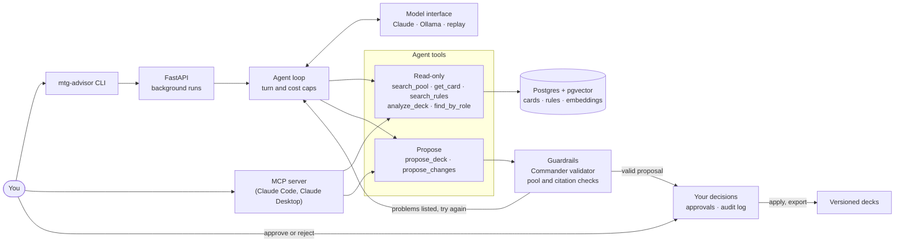

# MTG Deck Advisor

An AI agent that builds a legal Magic: The Gathering Commander deck from the cards you own, and
answers rules questions with citations.

You give it your collection (a card list, or a TCGplayer CSV export) and say what to build around,
or let it choose. Claude drafts a 100-card deck from your cards, searching them and the
Comprehensive Rules as it goes. Deterministic code checks every proposal, and nothing is saved
or exported until you approve it.

It's a portfolio project, built to show production AI engineering end to end:
- retrieval (RAG) tuned by measurement
- a bounded tool-calling agent
- guardrails that don't depend on the model behaving
- human approval and an audit log
- an evaluation suite that gates CI

## Try the demo

The demo needs only **Docker**: no API key, GPU or local models, and nothing is paid for. It
replays a recorded session, so every model call and search returns exactly what it did live.
From a clean clone it takes about 5 minutes, most of it Docker building the image.

It runs as its own Compose project with its own database, but it uses ports 5432 and 8000. If
you already run this project, stop that first with `docker compose down`, which keeps its data.

```bash
git clone https://github.com/Bacchetto/mtg-deck-advisor.git
cd mtg-deck-advisor
cp .env.demo .env
docker compose up -d --build --wait
```

That builds the image, migrates the database, and seeds it with the demo collection: 2,057 cards
(1,396 different) from three real TCGplayer collections and a random sample, with their
embeddings and the Comprehensive Rules. Then build a deck:

```bash
docker compose exec app mtg-advisor build
```

Type the answers the session was recorded with:

| Prompt | Type | What happens |
|---|---|---|
| `Which pool?` | `1` | the Demo collection |
| `What should the deck be built around?` | Enter | The agent chooses: it drafts a **Sheoldred, Whispering One** reanimator deck and explains why. |
| `>` | `a` | Approve the proposal, and save it as version 1. |
| `>` | `c` | Ask for a change. |
| `What should change?` | `Add more card draw and cut the weakest creatures.` | The agent proposes a five-card swap. |
| `>` | `a` | Approve the swap, saved as version 2. |
| `>` | `e`, then Enter | Export the 100-card decklist to `sheoldred-whispering-one.txt`. |
| `>` | `q` | quit |

Then ask a rules question:

```bash
docker compose exec app mtg-advisor ask "How much extra does it cost to cast my commander for the third time?"
docker compose exec app cat sheoldred-whispering-one.txt     # the exported decklist
docker compose down -v                                        # stop, and delete the demo's data
```

Two more questions are recorded:
- "My commander Sheoldred died and went to the graveyard. Can I move her to the command zone instead?"
- "Can my mono-black deck include a card with a red hybrid mana symbol in its rules text?"

**Anything else gets a clear "no recording for this request" error,** because this is a replay. A
CI job runs these exact steps on every push, so the demo can't break silently
([`scripts/check_demo.sh`](scripts/check_demo.sh)). To use your own cards with live models, see
[docs/setup.md](docs/setup.md).

## How it works: the agent proposes, code decides



**The agent's tools.** The agent (Claude Sonnet 5.5) has five read-only tools and two that propose. One read-only tool, `find_by_role`, is offered in refines only.
- **It holds no deck state, and no tool changes anything.** Deck state belongs to code.
- **Approving, applying and exporting aren't tools.** Only you can do them, and apply and export refuse to act without your approval record ([ADR 0013](docs/decisions/0013-an-agent-that-proposes-and-code-that-decides.md)).

**Every proposal is checked by code** before you see it, against:
- the Commander rules: 100 cards, singleton, color identity, the banned list and commander eligibility
- your collection
- the run's own lookups, since every card and rule it cites must have been looked up in that run

A failing proposal goes back to the agent with every problem listed.

**Grounded rules answers.** An answer is shown only if every rule it cites was retrieved in that
run. Otherwise it says "not found".

**Bounded runs:**
- **A turn limit, and a cost cap checked before each model call.**
- **Every run is recorded** with its transcript, tool calls, tokens, cost and latency, linked by a trace ID.

**Untrusted text is data.**
- **Card text, rules text and CSV fields** reach the model inside `<untrusted>` delimiters.
- **Even an obeyed injection can't change anything:** no tool it could call changes the deck.
- **Every decision is in an append-only audit log.**

**Search** is hybrid: vector search over local embeddings plus Postgres full-text search, fused by
reciprocal rank. It has exact filters (color identity, types, mana value, "in this pool"), and a
local model reranks the top 20 card candidates. Each rule is one chunk, cited by its number.

**Three ways to drive it,** all through the same API:
- the `mtg-advisor` CLI
- the HTTP API (its docs are at `/docs`)
- an MCP server for Claude Code or Claude Desktop, whose decision tools always bring up the client's permission prompt ([ADR 0015](docs/decisions/0015-decisions-through-mcp-permission-prompts.md))

## Results

Everything below was measured, and the run files behind each number are committed under
[`evals/`](evals/).

**Retrieval**, tuned on a dev set, then checked once on a held-out set written before any tuning
([report](evals/reports/2026-10-04-retrieval-test.md)):

| Held-out set | Before tuning | Now |
|---|---|---|
| Cards: recall@10 / MRR@10 | 0.63 / 0.54 | **0.72 / 0.79** |
| Rules: recall@10 / MRR@10 | 1.00 / 0.67 | **1.00 / 0.75** |

**The agent, by model** ([Milestone 7 report](evals/reports/2026-10-08-milestone-7.md)):

| | Sonnet 5.5 (shipped) | Haiku 4.5 |
|---|---|---|
| **Rules answers** (55 questions): correct, by a model grader | **99%** | 93% |
| Says "not found" when the rules don't cover it | **100%** | 30% |
| **Deck drafts** (8 tasks): legal deck | 100% | 100% |
| Turns per draft | **4.8** | 17.1 |
| Agent cost per deck | **$0.120** | $0.175 |
| Deck quality (1-5), by an Opus grader against a rubric | **3.30** | 2.87 |

**The cheaper model cost more per deck.** Haiku proposed illegal decks about five times per draft,
and each rejection cost another turn. See [the write-up](docs/findings/haiku-costs-more.md).

**How far the graders can be trusted.** The owner graded samples blind:
- **Deck grades:** they agreed with the Opus grader at a weighted kappa of **0.90** over 102 scores, and 99% of scores were within one point.
- **Rules answers:** they agreed with the Sonnet grader on 88% exactly.
- **Where the rules grader is conservative:** answers that add correct detail beyond the key facts.

**Prompt injection.** Sonnet never obeyed injected card or rule text in 5 cases, and the guardrails
held in every case.

**CI runs** on every pull request: lint, strict mypy, unit and integration tests, a secret scan, a
dependency audit and an image build. It also runs:
- **a free eval gate** on retrieval, the deck validator and pool resolution, from a committed
  embedding snapshot ([ADR 0016](docs/decisions/0016-evaluation-a-free-snapshot-gate-and-a-capped-live-eval.md))
- **the replayed Docker demo**

A capped live eval on the real model runs on every push to `main`. Both gates were shown to fail
on a deliberately degraded setting.

## Known limitations

- **The pool sets the ceiling.** On thin 300-card pools, the agent pads decks with lands and filler
  (quality 2.2-3.4). On real collections, its decks scored 4.2-4.5.
- **Refines are only somewhat better at doing what was asked.** A refine now turns the request
  into goals and checks its change against the saved deck. On six refine tasks, the grader's fit
  went from 3.50 to 3.67 out of 5
  ([#136](https://github.com/Bacchetto/mtg-deck-advisor/issues/136)), and judging what's "weakest"
  is still hard.
- **Rules answers cite more than they need.** Rules search no longer returns other variants'
  rules ([#138](https://github.com/Bacchetto/mtg-deck-advisor/issues/138)), but answers still cite
  supporting general rules, such as the casting steps for a question about flash. Citation
  precision is 92-94%.
- **The injection cases are few and domain-bound** ([#133](https://github.com/Bacchetto/mtg-deck-advisor/issues/133)).
- **A prompt change isn't caught before merge.** The live eval runs on `main`, not on pull
  requests: a deliberate trade against paying for every push.
- **There's no authentication.** The API listens only on `127.0.0.1`, and users, keys, rate limits
  and a spending cap come before any deployment.

## Design decisions

Each choice is recorded with its context, the alternatives and its consequences:

| ADR | Decision |
|---|---|
| [0001](docs/decisions/0001-structured-logging-with-structlog.md) | Structured JSON logging with structlog, standard-library logs included |
| [0002](docs/decisions/0002-psycopg-with-explicit-sql.md) | psycopg 3 with explicit SQL, no ORM |
| [0003](docs/decisions/0003-alembic-raw-sql-migrations-as-a-separate-step.md) | Alembic with raw SQL migrations, run as a separate step |
| [0004](docs/decisions/0004-local-tooling-on-a-network-drive.md) | Local tooling that works from a network drive: build, don't mount |
| [0005](docs/decisions/0005-http-retries-rate-limits-and-download-cache.md) | HTTP retries, rate limiting and the download cache |
| [0006](docs/decisions/0006-content-hashes-and-soft-deletes-for-ingestion.md) | Content hashes over normalised fields, and soft deletes, for ingestion |
| [0007](docs/decisions/0007-a-pure-commander-validator-that-cites-rules.md) | A pure Commander validator that reports every violation and cites its rule |
| [0008](docs/decisions/0008-one-model-interface-owned-by-the-project.md) | One model interface, owned by the project |
| [0009](docs/decisions/0009-local-models-chosen-by-measurement.md) | Local models, run natively and chosen by measurement |
| [0010](docs/decisions/0010-chunking-rules-by-rule-number.md) | Chunking the Comprehensive Rules by rule number |
| [0011](docs/decisions/0011-retrieval-improvements-chosen-on-a-dev-set.md) | Retrieval improvements, chosen on a dev set and checked on a held-out set |
| [0012](docs/decisions/0012-native-tool-calling-with-provider-turns-kept-verbatim.md) | Native tool calling, with each provider turn kept verbatim |
| [0013](docs/decisions/0013-an-agent-that-proposes-and-code-that-decides.md) | An agent that proposes, and code that decides |
| [0014](docs/decisions/0014-interfaces-background-runs-a-thin-cli-and-mcp.md) | Interfaces: background runs, a thin CLI, and MCP with the client as the agent |
| [0015](docs/decisions/0015-decisions-through-mcp-permission-prompts.md) | Decisions through MCP, allowed in the client's own permission prompt |
| [0016](docs/decisions/0016-evaluation-a-free-snapshot-gate-and-a-capped-live-eval.md) | Evaluation: a free snapshot gate on every PR, and a capped live eval on main |

The product, requirements and milestones are in [docs/project-plan.md](docs/project-plan.md) and
[docs/requirements.md](docs/requirements.md).

## Layout

```
src/mtg_deck_advisor/
  ingestion/      Scryfall and rules loaders, pool parsers, name resolution  (ING)
  deck/           deck state, card facts, versioned deck storage
  retrieval/      embeddings, summaries, hybrid search, reranking            (RAG)
  llm/            one interface for all model calls; Claude, Ollama, replay  (MOD)
  agent/          the tool-calling agent loop, its tools and flows           (AGT)
  guardrails/     deck validator, proposal checks, approvals, audit log      (GRD)
  evaluation/     eval suites, the CI gate, hand grading                     (EVL)
  observability/  logging, tracing, cost and latency                         (OBS)
  demo/           the demo dataset's export and seed
  db/             migrations and connections
  api/            the HTTP API
  cli.py          the mtg-advisor CLI, a thin client of the API
  mcp_server/     the MCP server
tests/              unit tests, and integration tests against Postgres + pgvector
evals/              datasets, rubrics, the embedding snapshot, run files, reports
demo/               the demo collection and its dataset
recordings/         recorded model responses, the demo session among them
docs/               setup, project plan, requirements, decision records
```

## Development

```bash
python -m venv .venv
# Windows: .venv\Scripts\activate    macOS/Linux: source .venv/bin/activate
pip install -e ".[dev]"
pre-commit install          # secret scanning and ruff on every commit
cp .env.example .env

docker compose up -d --wait db           # just the database: Postgres 16 + pgvector
python -m mtg_deck_advisor.db.migrate    # apply database migrations
python -m mtg_deck_advisor.api           # API on http://127.0.0.1:8000

ruff check . && ruff format --check .
mypy
pytest -m "not integration"   # unit tests: fast, no Docker
pytest -m integration         # integration tests: start their own pgvector container
sh scripts/check_demo.sh      # the replayed demo, in its own Compose project
```

**Notes:**
- **Port 8000:** the API container and a host-run API both use it, so run one or the other.
- **Rebuild after changing the source:** code is built into the image, not mounted ([ADR 0004](docs/decisions/0004-local-tooling-on-a-network-drive.md)), so run `docker compose up -d --build`.
- **Docker for integration tests:** they need a running Docker engine, and start and remove their own database container.

Loading the full card catalogue, the local models and the rest are in [docs/setup.md](docs/setup.md).
